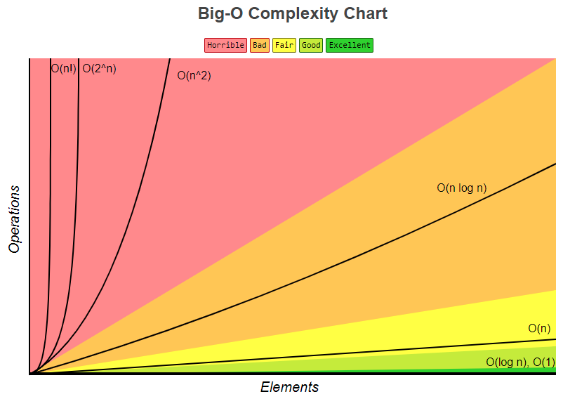

# Projeto espelhado do reposit�rio do Github do Eduardo Pires de uma v�deo aula postada no Youtube
- Link v�deo aula NOTA��O BIG-O COMO CLASSIFICAR A COMPLEXIDADE DE UM C�DIGO? VOC� PRECISA SABER!: 
	- https://www.youtube.com/watch?v=KjJwx-AB4KI&ab_channel=desenvolvedor.io
- Link do reposit�rio 
	- https://github.com/EduardoPires/big-o-notation

# Big-O - Defini��o, Exemplos e Benchmark
Em poucas palavras, Big-O � uma classifica��o para a complexidade do algoritmo baseada no custo ou tempo de processamento.

## **Big-O - Nota��es**
As nota��es Big-O s�o nota��es matem�ticas que podem ser usadas para descrever a complexidade do algoritmo.

### O(1) (constante)
N�o h� crescimento do n�mero de opera��es, pois n�o depende do volume de dados de entrada (n).

### O(log n) (logaritmo) 
O crescimento do n�mero de opera��es � menor do que o do n�mero de itens.

### O(n) (linear)
O crescimento no n�mero de opera��es � diretamente proporcional ao crescimento do n�mero de itens.

### O(n log n) (linearitmica ou quasilinear)
� o resultado das opera��es **(log n)** executada **n** vezes.

### O(n^2) (quadr�tico)
Ocorre quando os itens de dados s�o processados aos pares, muitas vezes com repeti��es dentro da outra.

### O(2^n) (exponencial)
A medida que n aumenta, o fator analisado (tempo ou espa�o) aumenta exponencialmente.

### O(n!) (fatorial)
O número de instruções executadas cresce muito rapidamente para um pequeno número de dados.

## **Big-O - Nota��o Alternativa**

| Big-O         | Alternativa   |
| ------------- | ------------- |
| **O(1)**  	  | **O(yeah)**	  |
| **O(log n)** 	| **O(nice)**	  |
| **O(n)** 		  | **O(ok)**		  |
| **O(n log n)**| **O(uch)**  	|
| **O(n^2)** 	  | **O(my)** 	  |
| **O(2^n)**  	| **O(no)**	 	  |
| **O(n!)**		  | **O(mg!)**  	|

BenchmarkDotNet v0.13.12, 
Windows 11 (10.0.22631.3296/23H2/2023Update/SunValley3)
Intel Core i7-10700K CPU 3.80GHz, 1 CPU, 16 logical and 8 physical cores
.NET SDK 8.0.200
  [Host]     : .NET 8.0.2 (8.0.224.6711), X64 RyuJIT AVX2 [AttachedDebugger]
  DefaultJob : .NET 8.0.2 (8.0.224.6711), X64 RyuJIT AVX2

 Method       | Mean                | Error             | StdDev            | Median              | Rank |
------------- |--------------------:|------------------:|------------------:|--------------------:|-----:|
 O(1)         |           0.0037 ns |         0.0074 ns |         0.0062 ns |           0.0000 ns |    1 |
 'O(log n)'   |           6.6633 ns |         0.0323 ns |         0.0286 ns |           6.6632 ns |    2 |
 O(n)         |          13.5757 ns |         0.0706 ns |         0.0660 ns |          13.5988 ns |    3 |
 'O(n log n)' |      91,671.4119 ns |     1,343.8737 ns |     1,257.0603 ns |      91,341.9678 ns |    4 |
 O(n^2)       |  86,231,882.1429 ns |   147,447.3882 ns |   130,708.2691 ns |  86,216,733.3333 ns |    5 |
 O(2^n)       | 540,358,650.0000 ns | 6,393,549.1299 ns | 5,667,714.7712 ns | 538,122,250.0000 ns |    6 |
